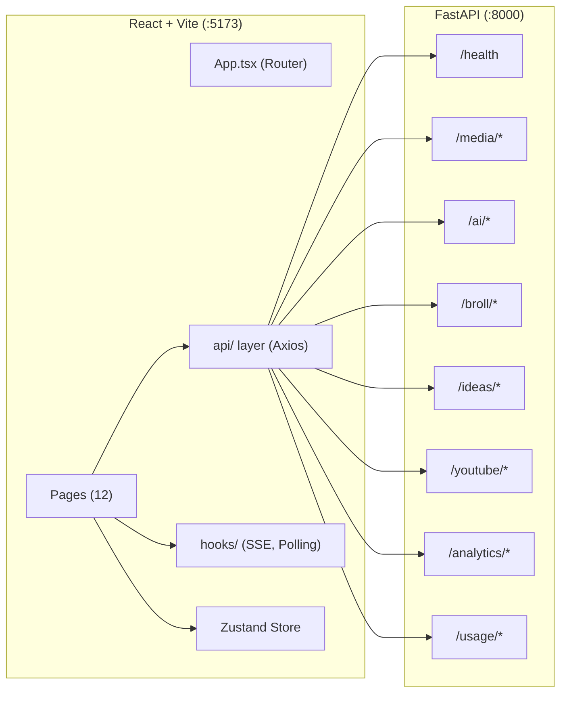
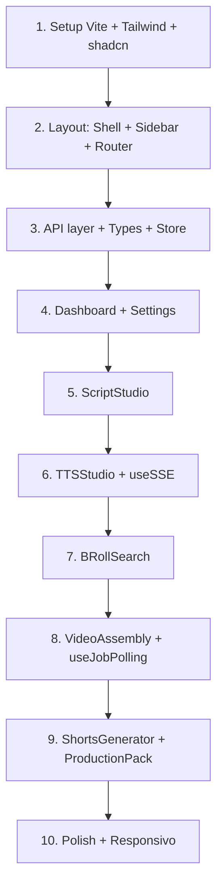

# Frontend React + Vite — Plano de Implementação

## Contexto

O backend FastAPI (`app/main.py`) foi implementado com sucesso seguindo o [plano_melhoria.md](file:///home/aerlonga/tts_app/plano/plano_melhoria.md). O frontend atual é um monólito HTML/JS de 80KB ([index.html](file:///home/aerlonga/tts_app/index.html)) servido pelo Flask legado. Este plano cria o frontend React + Vite que consome exclusivamente a API FastAPI (`localhost:8000`), substituindo o `index.html`.

O plano existente em [parte_15_frontend_react_vite.md](file:///home/aerlonga/tts_app/plano/parte_15_frontend_react_vite.md) serve como referência mas precisa de ajustes para refletir o backend real implementado, incluindo o `production_pack` do [shorts_contract.py](file:///home/aerlonga/tts_app/shorts_contract.py).

---

## Decisões Confirmadas

- ✅ **Estilização**: Tailwind CSS v4 + shadcn/ui com customização do theme para replicar a paleta dark/cinematic do `index.html` legado
- ✅ **Idioma da interface**: Português (mesmo padrão do `index.html` atual)
- ✅ **API Key**: Sessão server-side (não mais localStorage). Ver detalhes na seção [Estratégia de Sessão](#estratégia-de-sessão-server-side-para-api-key)

---

## Open Questions

1. **Proxy reverso**: O frontend Vite roda em `:5173` e o backend em `:8000`. Podemos configurar `vite.config.ts` com proxy para evitar CORS durante dev. Mas o backend também precisa de CORS middleware para produção. Confirma?

2. **Flask legado**: O `index.html` atual é servido pelo Flask (`app.py:5000`). Quando o React estiver funcional, o Flask pode ser desligado? Ou precisa coexistir?

3. **Prioridade de páginas**: O plano prevê 12 páginas. Podemos implementar em fases — quais são prioritárias para a V1?
   - **Fase 1 (Core pipeline)**: Dashboard, ScriptStudio, TTSStudio, VideoAssembly, ShortsGenerator, BRollSearch, Settings
   - **Fase 2 (Growth tools)**: IdeasLab, YouTubeResearch, ChannelAnalytics, AIAssistant, UsageCosts

---

## Estratégia de Sessão Server-Side para API Key

Em vez de salvar a API key em localStorage e enviá-la em cada request (como no `index.html` atual), o novo frontend usará **sessão server-side**:

### Backend — Novo endpoint de sessão

#### [MODIFY] [main.py](file:///home/aerlonga/tts_app/app/main.py)

Adicionar middleware de sessão com `starlette.middleware.sessions`:

```python
from starlette.middleware.sessions import SessionMiddleware

app.add_middleware(SessionMiddleware, secret_key="<gerar-segredo-local>")
```

#### [NEW] `app/routers/auth.py`

Endpoints de sessão:

```
POST /auth/login    — recebe { gemini_api_key } → salva na sessão → retorna 200
GET  /auth/status    — retorna { authenticated: bool }
POST /auth/logout    — limpa sessão → retorna 200
```

### Frontend — Fluxo

1. Ao abrir o app, `GET /auth/status` verifica se há sessão ativa
2. Se não autenticado, exibe tela de login com campo de API key
3. Ao submeter, `POST /auth/login` salva a key na sessão server-side
4. Todas as requisições subsequentes usam o cookie de sessão — **a API key não trafega mais em cada request**
5. Os services do backend leem a API key da sessão (ou do `.env` como fallback)

### Impacto nos Services

Os services atuais recebem `api_key: str | None` como parâmetro. Será adicionada lógica para:
1. Primeiro checar se veio `api_key` no request (retrocompatibilidade com Swagger)
2. Se não, ler da sessão (`request.session.get("gemini_api_key")`)
3. Se não, usar `settings.gemini_api_key` do `.env`

> [!NOTE]
> Essa abordagem é mais segura que localStorage — a key nunca fica exposta no browser (DevTools > Application > Storage). O cookie de sessão é httpOnly.

---

## Arquitetura



---

## Mapeamento de Endpoints (Backend real → Frontend)

Baseado no backend implementado:

| Router | Endpoint | Método | Frontend Page |
|--------|----------|--------|---------------|
| health | `/health` | GET | Dashboard |
| health | `/health/details` | GET | Dashboard, Settings |
| media | `/media/generate-script` | POST | ScriptStudio |
| media | `/media/enhance` | POST | ScriptStudio, TTSStudio |
| media | `/media/generate-tts` | POST | TTSStudio |
| media | `/media/generate-tts-stream` | POST | TTSStudio |
| media | `/media/generate-short` | POST | ShortsGenerator |
| media | `/media/assemble` | POST | VideoAssembly |
| media | `/media/assemble/status/{id}` | GET | VideoAssembly |
| media | `/media/assemble/download/{id}` | GET | VideoAssembly |
| media | `/media/generate-video` | POST | VideoAssembly |
| media | `/media/search-assets` | POST | BRollSearch |
| broll | `/broll/search` | POST | BRollSearch |
| broll | `/broll/download` | POST | BRollSearch |
| ai | `/ai/generate` | POST | AIAssistant |
| ai | `/ai/assistant` | POST | AIAssistant |
| ideas | `/ideas/generate` | POST | IdeasLab |
| youtube | `/youtube/search` | GET | YouTubeResearch |
| youtube | `/youtube/videos/{id}` | GET | YouTubeResearch |
| youtube | `/youtube/channels/{id}` | GET | YouTubeResearch |
| analytics | `/analytics/youtube/*` | GET | ChannelAnalytics |
| usage | `/usage/summary` | GET | UsageCosts, Dashboard |
| usage | `/usage/by-feature` | GET | UsageCosts |

---

## Proposed Changes

### 1. Project Setup

#### [NEW] `frontend/` — Projeto Vite + React + TypeScript

Criado via:
```bash
npx -y create-vite@latest frontend -- --template react-ts
```

Dependências adicionais:
```
react-router-dom @tanstack/react-query zustand axios
tailwindcss @tailwindcss/vite
lucide-react recharts react-markdown
react-hook-form @hookform/resolvers zod
```

> [!NOTE]
> **shadcn/ui** será instalado via `npx shadcn@latest init` após o setup do Tailwind. Componentes adicionados sob demanda (`npx shadcn@latest add button card input textarea select tabs dialog toast`).

---

### 2. Configuração

#### [NEW] `frontend/vite.config.ts`

```ts
export default defineConfig({
  plugins: [react(), tailwindcss()],
  server: {
    port: 5173,
    proxy: {
      '/api': {
        target: 'http://localhost:8000',
        changeOrigin: true,
        rewrite: (path) => path.replace(/^\/api/, ''),
      },
    },
  },
});
```

> [!NOTE]
> O proxy `/api` → `localhost:8000` evita CORS em dev. O Axios client usará `/api/media/...` em dev. Em produção, apontar direto para o backend.

#### [NEW] `frontend/.env`
```
VITE_API_BASE_URL=/api
```

> [!NOTE]
> O secret key da sessão será gerado automaticamente na inicialização ou lido de `SESSION_SECRET_KEY` no `.env` do backend.

---

### 3. Design System — Paleta Dark/Cinematic

Replicando a estética do `index.html` legado com Tailwind:

#### [NEW] `frontend/src/index.css`

Customização do Tailwind theme para a paleta amber/dark:

| Token (legado) | Valor | Uso |
|----------------|-------|-----|
| `--bg` | `#080A0C` | Background principal |
| `--bg2` | `#0E1014` | Cards, panels |
| `--bg3` | `#141720` | Inputs focus |
| `--border` | `#1E2330` | Bordas leves |
| `--border2` | `#2A3040` | Bordas destacadas |
| `--amber` | `#C8840A` | Accent principal |
| `--green` | `#2DB87A` | Sucesso |
| `--red` | `#E0504A` | Erro |
| `--blue` | `#4C8EF5` | Info |
| `--text` | `#D4D8E2` | Texto principal |
| `--text2` | `#8B92A8` | Texto secundário |
| `--text3` | `#505770` | Texto terciário |

Fontes: `Bebas Neue` (display), `DM Mono` (mono), `DM Sans` (sans).

---

### 4. Estrutura de Pastas

```
frontend/src/
├── api/
│   ├── client.ts          # Axios instance + interceptors
│   ├── media.ts           # /media/* endpoints
│   ├── ai.ts              # /ai/* endpoints
│   ├── broll.ts           # /broll/* endpoints
│   ├── ideas.ts           # /ideas/*
│   ├── youtube.ts         # /youtube/*
│   ├── analytics.ts       # /analytics/*
│   ├── usage.ts           # /usage/*
│   └── health.ts          # /health, /health/details
├── components/
│   ├── layout/
│   │   ├── AppShell.tsx      # Sidebar + main content
│   │   ├── Sidebar.tsx       # Navigation sidebar
│   │   └── Header.tsx        # Top bar (API key, status)
│   ├── media/
│   │   ├── AudioPlayer.tsx   # Reusable audio player
│   │   ├── VideoPlayer.tsx   # Reusable video player  
│   │   ├── FileUpload.tsx    # Drag & drop upload
│   │   ├── ProgressBar.tsx   # Assembly/TTS progress
│   │   └── AssetGrid.tsx     # Asset thumbnails grid
│   ├── shorts/
│   │   ├── ShortCard.tsx           # Individual short card
│   │   ├── ProductionPackPanel.tsx # Flow/Whisk prompts display
│   │   └── TimelineView.tsx        # Visual timeline segments
│   └── common/
│       ├── Alert.tsx         # Status alerts
│       ├── CopyButton.tsx    # Copy to clipboard
│       ├── Loading.tsx       # Loading spinner/skeleton
│       └── EmptyState.tsx    # Empty content placeholder
├── pages/
│   ├── Dashboard.tsx
│   ├── ScriptStudio.tsx
│   ├── TTSStudio.tsx
│   ├── VideoAssembly.tsx
│   ├── ShortsGenerator.tsx
│   ├── BRollSearch.tsx
│   ├── IdeasLab.tsx
│   ├── YouTubeResearch.tsx
│   ├── ChannelAnalytics.tsx
│   ├── AIAssistant.tsx
│   ├── UsageCosts.tsx
│   └── Settings.tsx
├── hooks/
│   ├── useSSE.ts           # Server-Sent Events for TTS streaming
│   ├── useJobPolling.ts    # Video assembly job polling
│   └── useAuth.ts          # Session status check via /auth/status
├── stores/
│   └── appStore.ts         # Zustand: voice, preferences, pipelineState (API key NOT stored here)
├── types/
│   ├── media.ts            # Mirrors app/schemas/media.py
│   ├── ai.ts               # Mirrors app/schemas/ai.py
│   ├── ideas.ts
│   ├── youtube.ts
│   ├── analytics.ts
│   └── usage.ts
├── lib/
│   └── utils.ts            # escHtml, formatDuration, naturalSort, etc.
├── App.tsx                 # Router setup
├── main.tsx                # Entry point + QueryClientProvider + Zustand
└── index.css               # Tailwind base + custom tokens
```

---

### 5. Tipos TypeScript (espelhando Pydantic)

#### [NEW] `frontend/src/types/media.ts`

Espelha exatamente [app/schemas/media.py](file:///home/aerlonga/tts_app/app/schemas/media.py):

```typescript
// Mirrors ShortPromptItem
export interface ShortPromptItem {
  cue: string;
  prompt: string;
}

// Mirrors WhiskPromptItem
export interface WhiskPromptItem {
  cue: string;
  prompt: string;
}

// Mirrors TimelineSegment
export interface TimelineSegment {
  slot_index: number;
  asset_kind: 'video' | 'image';
  duration_seconds: number;
  motion_preset: string;
  overlay_text: string | null;
}

// Mirrors ProductionPack
export interface ProductionPack {
  template_id: string;
  flow_video_prompt: string;
  whisk_image_prompts: WhiskPromptItem[];
  timeline_segments: TimelineSegment[];
  caption_text: string;
  cta_text: string;
}

// Mirrors ShortItem  
export interface ShortItem {
  id: string;
  title: string;
  hook: string;
  script: string;
  cta: string;
  image_prompts: ShortPromptItem[];
  broll_keywords: string[];
  production_pack: ProductionPack | null;
}

// Mirrors GenerateShortResponse
export interface GenerateShortResponse {
  shorts: ShortItem[];
  count: number;
  duration_seconds: number;
}
```

---

### 6. Hooks Críticos

#### [NEW] `frontend/src/hooks/useSSE.ts`

O TTS streaming usa SSE (`text/event-stream`). Este hook encapsula a lógica de parsing que hoje está no `index.html` (linhas 1674-1734):

```typescript
// Events: session, skipped, progress, waiting, error, done
// done event contains audio_b64 (base64 WAV)
```

#### [NEW] `frontend/src/hooks/useJobPolling.ts`

O video assembly usa polling (`/media/assemble/status/{job_id}`). Este hook encapsula a lógica das linhas 2060-2094 do `index.html`:

```typescript
// Poll every 3-5s until status === 'done' | 'error'
// Returns: { status, progress, downloadUrl, error }
```

---

### 7. Páginas — Detalhamento

#### 7.1 Dashboard (`/`)
- Card health status (`GET /health/details`)
- Card resumo de custo IA (`GET /usage/summary`)  
- Quick links para pipeline stages
- Últimos jobs de vídeo (se implementado)

#### 7.2 ScriptStudio (`/scripts`)
Replica **Stage 1** do index.html:
- Input URL → `POST /media/generate-script`
- Textarea editável com roteiro
- Painel de image prompts com botão copiar individual e copiar todos
- Toggle de entonação → `POST /media/enhance`
- Botão "Avançar para TTS" (navega para `/tts` passando o script via Zustand)

#### 7.3 TTSStudio (`/tts`)
Replica **Stage 2** do index.html:
- Grid de vozes (Charon, Fenrir, Orus, Aoede, Puck, Kore, Alnilam, Enceladus, Gacrux, Umbriel, Schedar)
- Textarea do roteiro (pre-populated via Zustand se veio do ScriptStudio)
- Toggle "Entonação Inteligente"
- Botão "Gerar Áudio" → `POST /media/generate-tts-stream` via `useSSE`
- Progress bar com chunks processados
- Log stream com eventos SSE
- Audio player + botão download WAV
- Botão "Avançar para Assembly"

#### 7.4 VideoAssembly (`/assembly`)
Replica **Stage 3 + Stage 4** do index.html:
- Tab "Buscar B-Roll" → usa `BRollSearch` inline ou link
- Tab "Mídias" → upload drag & drop de imagens/vídeos
- Lista unificada de assets com reordenação
- Upload de áudio WAV (ou usa áudio do TTSStudio via Zustand)
- Botão "Montar Vídeo" → `POST /media/assemble`
- Progress bar via `useJobPolling`
- Video player + download MP4

#### 7.5 ShortsGenerator (`/shorts`) 
Replica **Stage 5** do index.html + **production_pack** novo:
- Textarea com roteiro longo de referência
- Config: quantidade (2-3), duração (45s/60s/65s)
- Botão "Gerar Shorts" → `POST /media/generate-short`
- **Cards por short** com:
  - Título editável
  - Script editável
  - Hook e CTA como pills
  - B-Roll keywords como tags
  - **Painel de Image Prompts** (collapse) com copiar individual
  - **Painel Production Pack** (collapse) — **NOVO**, não existe no index.html:
    - Flow Video Prompt com botão copiar
    - 5 Whisk Image Prompts com botão copiar individual
    - Timeline visual mostrando 6 segmentos com duração, preset, overlay
    - Caption text e CTA text destacados
  - Botões: "Gerar Áudio" (TTS inline), "Montar Short" (assembly inline)
  - Audio player e video player inline

> [!NOTE]
> O `ProductionPackPanel.tsx` é o componente novo que não existia no frontend legado. Ele exibe o `production_pack` retornado pelo [shorts_contract.py](file:///home/aerlonga/tts_app/shorts_contract.py), com ações de copy para cada prompt Flow/Whisk, e uma visualização da timeline de 62s.

#### 7.6 BRollSearch (`/broll`)
- Input de keywords com seletor de coleção
- Grid de resultados com thumbnails
- Preview modal (iframe archive.org)
- Botão "Baixar" → `POST /broll/download`
- Lista de clips selecionados

#### 7.7-7.12 (Fase 2)
IdeasLab, YouTubeResearch, ChannelAnalytics, AIAssistant, UsageCosts, Settings — implementados em fase posterior.

---

### 8. Backend — Ajustes necessários

#### [MODIFY] [main.py](file:///home/aerlonga/tts_app/app/main.py)

Adicionar CORS middleware:

```python
from fastapi.middleware.cors import CORSMiddleware

app.add_middleware(
    CORSMiddleware,
    allow_origins=["http://localhost:5173"],
    allow_credentials=True,
    allow_methods=["*"],
    allow_headers=["*"],
)
```

> [!WARNING]
> **Sem CORS, nenhuma requisição do frontend Vite funcionará**. Este é o primeiro passo obrigatório antes de qualquer teste de integração.

---

## Verification Plan

### Automated Tests
1. `npm run build` — verifica se o projeto compila sem erros TypeScript
2. `npm run dev` — verifica se o Vite dev server sobe
3. Navegação entre todas as rotas funciona sem crashes

### Manual Verification (Browser)
Para cada página da Fase 1:

| Página | Teste |
|--------|-------|
| Dashboard | Health check verde, usage summary carrega |
| ScriptStudio | URL → Roteiro → Prompts → Copiar funciona |
| TTSStudio | Vozes selecionáveis → TTS streaming → Audio player |
| VideoAssembly | Upload assets → Montar → Polling → Video player |
| ShortsGenerator | Gerar shorts → Cards → Production Pack → Copiar prompts |
| BRollSearch | Pesquisar → Grid → Preview → Download |
| Settings | Login com API key → sessão ativa → logout funciona |

### Integração End-to-End
1. URL → Script → TTS → Assembly → Video final
2. Script → Shorts → TTS individual → Short montado
3. B-Roll search → Select → Assembly com B-Roll

---

## Etapas de Implementação (Ordem)



| # | Etapa | Estimativa |
|---|-------|-----------|
| 1 | Setup projeto + Tailwind + shadcn | 1-2h |
| 2 | Layout shell + Sidebar + Router | 2-3h |
| 3 | API layer + TypeScript types + Zustand | 2h |
| 4 | Dashboard + Settings | 2-3h |
| 5 | ScriptStudio | 3-4h |
| 6 | TTSStudio + useSSE hook | 4-5h |
| 7 | BRollSearch | 2-3h |
| 8 | VideoAssembly + useJobPolling | 4-5h |
| 9 | ShortsGenerator + ProductionPackPanel | 4-5h |
| 10 | Polish, animações, responsivo | 2-3h |
| **Total Fase 1** | | **~26-33h** |
