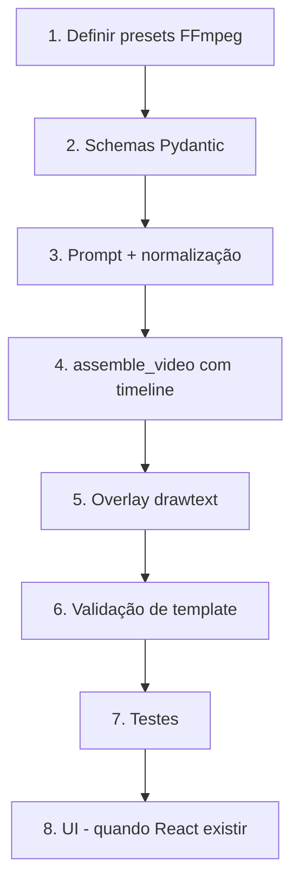

# Análise do Plano V1: Pack de Produção Flow + Whisk

## Veredicto geral

**O plano faz sentido e está bem alinhado com o sistema real.** A leitura do código confirma que os gaps listados existem, as extensões propostas são tecnicamente viáveis, e a abordagem de não mexer no fluxo antigo é a decisão correta. Abaixo detalho ponto a ponto o que bate, o que tem risco, e o que recomendo ajustar.

---

## 1. Diagnóstico dos gaps — ✅ Preciso

O plano lista 8 gaps. Todos se confirmam pelo código:

| Gap declarado | Evidência no código |
|---|---|
| Não existe `production_pack` | [short_service.py](file:///home/aerlonga/tts_app/app/services/short_service.py) retorna apenas `shorts`, `count`, `duration_seconds`, `usage` |
| Sem distinção vídeo vs imagem nos prompts | `SHORTS_SYSTEM_PROMPT` pede `image_prompts` genéricos sem separar tipo de asset |
| Timeline divide áudio igualmente | [assemble_video L310](file:///home/aerlonga/tts_app/app.py#L310): `duration_per_asset = total_duration / n` — divisão uniforme |
| Movimentos genéricos alternados | [assemble_video L344-349](file:///home/aerlonga/tts_app/app.py#L344-L349): zoom in/out alternando por `idx % 2` |
| Sem overlay de caption/CTA | Nenhum filtro `drawtext` em todo o `assemble_video` |
| UI não expõe fluxo de copiar prompts | Frontend atual é o `index.html` monolítico (79KB) — sem ações de copy específicas para Flow/Whisk |
| Sem validação `1 vídeo + 5 imagens` | `_save_assets` aceita qualquer quantidade/tipo de assets |
| Sem testes para resposta enriquecida | `tests.py` testa shorts apenas no formato antigo (L132-213) |

> [!TIP]
> O diagnóstico é a parte mais sólida do plano. Pode ser usado direto como referência de "estado atual" na documentação.

---

## 2. Extensão do schema — ✅ Bem pensada, com um ajuste

O plano propõe adicionar `ProductionPack`, `TimelineSegment`, `WhiskPromptItem` ao schema Pydantic em [media.py](file:///home/aerlonga/tts_app/app/schemas/media.py).

**O que está bom:**
- Manter `ShortItem` com os campos antigos (`title`, `hook`, `script`, `cta`, `image_prompts`, `broll_keywords`) garante retrocompatibilidade
- `production_pack` como campo opcional no `ShortItem` é a abordagem mais segura

**Ajuste recomendado:**

> [!IMPORTANT]
> O plano diz "adicionar `production_pack` por Short", mas não explicita se será um campo `Optional[ProductionPack]` dentro de `ShortItem` ou um campo paralelo na response. Recomendo que seja `ShortItem.production_pack: ProductionPack | None = None` — assim a response `GenerateShortResponse` não muda de shape, e clientes antigos simplesmente ignoram o campo extra.

---

## 3. Atualização do prompt Gemini — ⚠️ Risco médio

O plano quer que o `SHORTS_SYSTEM_PROMPT` passe a retornar JSON com `flow_video_prompt`, `whisk_image_prompts`, `timeline_segments`, etc.

**Risco real:** O prompt atual já tem dificuldade em retornar JSON limpo — é por isso que existem `extract_json_block` e `normalize_short_item` com tolerância a erros. Pedir um JSON **muito mais complexo** ao modelo aumenta a chance de:
- Campos omitidos (especialmente `timeline_segments` que é repetitivo)
- Contagem errada de prompts (pediu 5, veio 4)
- Formato inconsistente do `caption_text` e `cta_text`

**Recomendação:**

> [!WARNING]
> Em vez de pedir tudo em um único prompt com JSON gigante, considere uma de duas alternativas:
> 1. **Pós-processamento determinístico**: Peça ao Gemini apenas os campos criativos (`flow_video_prompt`, 5 `whisk_image_prompts`, `caption_text`, `cta_text`) e monte o `timeline_segments` e `template_id` no código Python — eles são determinísticos e não precisam do modelo.
> 2. **Prompt em duas etapas**: Primeiro gera o short normal, depois faz uma segunda chamada pedindo apenas os prompts Flow/Whisk com base no short gerado.
>
> A opção 1 é mais barata e mais confiável. Os `timeline_segments` com durações `[8, 9, 10, 10, 12, 13]` são fixos — não faz sentido pedir ao modelo para "inventar" algo que já está definido.

---

## 4. Motor de montagem com timeline fixa — ✅ Viável, complexidade real

A mudança mais profunda é em [assemble_video](file:///home/aerlonga/tts_app/app.py#L281-L427). Hoje a função:
1. Calcula `duration_per_asset = total_duration / n`
2. Gera clips individuais com Ken Burns genérico
3. Concatena tudo

O plano quer:
1. Ler metadados por cena (slot, duration, motion_preset, overlay_text)
2. Cada cena com duração exata
3. Presets nomeados diferentes de Ken Burns genérico
4. Overlay de texto nas cenas 4 e 5

**Análise:**

- ✅ A arquitetura two-pass (clip individual → concat) é **ideal** para isso. Cada clip já é gerado isoladamente — basta variar o filtro por preset em vez de alternar zoom in/out.
- ✅ Substituir `duration_per_asset` por `segment.duration_seconds` é trivial.
- ⚠️ O `parallax_subtle` e `caption_emphasis` precisam de definição técnica em FFmpeg. O plano não detalha o que cada preset faz em termos de filtros — isso vai precisar de prototipação.
- ⚠️ O overlay com `drawtext` não é complexo, mas precisa de uma font que exista no sistema. Considere embutir uma font fallback ou usar `fontfile` explícito.

> [!IMPORTANT]
> **A função `assemble_video` está no `app.py` legado**, não no `video_service.py` do FastAPI. O `video_service.py` importa ela via `from app import assemble_video`. Isso significa que a mudança precisa ser feita no módulo legado ou, preferencialmente, a função precisa ser migrada para `video_service.py` antes dessa feature. Caso contrário, o `app.py` vai continuar crescendo com lógica nova misturada à lógica Flask antiga.

---

## 5. Presets visuais — ⚠️ Subdefinidos

O plano lista 6 presets mas não especifica o que cada um faz tecnicamente:

| Preset | Papel no template | Definição FFmpeg? |
|---|---|---|
| `flow_open` | "clipe de vídeo vertical, sem Ken Burns" | ✅ Claro — já existe no código (trim + scale sem zoompan) |
| `zoom_slow` | Imagem 1 | ❓ É o zoom in atual com velocidade menor? Qual `z_expr`? |
| `pan_lateral` | Imagem 2 | ❓ `zoompan` não faz pan lateral nativo. Precisa de `crop` animado ou `overlay` com scroll. É mais complexo que parece. |
| `parallax_subtle` | Imagem 3 | ❓ Parallax real precisa de depth map ou duas layers. Sem definição, vai virar outro zoom. |
| `caption_emphasis` | Imagem 4 | ❓ O "emphasis" é visual (zoom rápido no texto?) ou é só o overlay do `caption_text`? |
| `cta_hold` | Imagem 5 | ❓ Hold = estático sem movimento? Ou zoom muito lento? |

> [!WARNING]
> Sem definição técnica, os presets viram armadilha de scope. Recomendo definir cada preset como um filtro FFmpeg concreto antes de implementar. Exemplo:
> - `zoom_slow`: `zoompan z='min(zoom+0.0008,1.3)'` (metade da velocidade atual)
> - `pan_lateral`: `crop=w=iw*0.8:h=ih:x='(iw-ow)*t/duration':y=0` (scroll horizontal)
> - `parallax_subtle`: igual ao `zoom_slow` com ponto focal descentrado
> - `caption_emphasis`: zoom moderado + drawtext
> - `cta_hold`: estático (sem zoompan, só scale + pad)

---

## 6. Overlay textual — ✅ Simples e correto

O plano especifica overlay apenas nas cenas 4 e 5, com estilo fixo. Isso é implementável com um único filtro `drawtext` no FFmpeg:

```
drawtext=text='Caption text':fontsize=48:fontcolor=white:
  x=(w-tw)/2:y=h*0.7:
  box=1:boxcolor=black@0.6:boxborderw=20
```

A decisão de estilo fixo na V1 é acertada — edição livre de texto em vídeo é um rabbit hole.

---

## 7. Validação de input — ✅ Necessária e bem scoped

O plano pede rejeitar montagem se:
- Não tiver exatamente 6 assets (1 vídeo + 5 imagens)
- Duração total do manifest ≠ 62s
- Assets fora de ordem

Isso é factível e importante. Hoje o [_save_assets](file:///home/aerlonga/tts_app/app/services/video_service.py#L61-L104) aceita qualquer input sem validação de template.

> [!TIP]
> Crie a validação como uma função separada (`validate_template_v1`) que roda **antes** de chamar `assemble_video`. Não misture validação de template dentro da montagem genérica.

---

## 8. UI — ⚠️ Depende do frontend

O plano menciona adaptar a UI de Shorts para exibir e copiar o production pack. Mas:

- O frontend atual é o `index.html` de 79KB (Flask/jQuery?)
- Existe um plano separado de [React + Vite](file:///home/aerlonga/tts_app/plano/parte_15_frontend_react_vite.md) que ainda não foi implementado
- A página `ShortsGenerator.tsx` do plano React já prevê cards com prompts e ações de cópia

> [!IMPORTANT]
> **Decisão necessária:** A UI do production pack vai ser implementada no `index.html` legado ou no novo frontend React? Se o React ainda não existe, fazer no `index.html` é retrabalho. Se for esperar o React, a feature backend fica pronta mas sem UI.
>
> Recomendação: implemente o backend completo + testes, e entregue um endpoint que retorna o `production_pack` em JSON. A UI pode ser feita depois, no React, sem retrabalho.

---

## 9. Testes — ✅ Bem definidos

Os critérios de aceite cobrem:
- Geração (pack válido, contagem correta, retrocompatibilidade)
- Parsing (defaults seguros, rejeição de packs inválidos)
- Montagem (durações, presets, overlays, fluxo antigo intacto)
- UI (cópia, ordem)

Isso é suficiente para a V1. Os testes atuais em [tests.py](file:///home/aerlonga/tts_app/tests.py) podem ser estendidos sem conflito.

---

## 10. Assunções — ✅ Corretas e realistas

Todas as assunções fazem sentido:
- V1 manual (sem API do Flow/Whisk) ← correto, essas APIs não existem publicamente
- Template fixo 62s ← bom para V1, parametrizar depois
- 9:16 sempre ← correto para Shorts/TikTok
- Fluxo antigo intacto ← essencial

---

## Resumo: O que está bom vs. o que precisa de atenção

### ✅ Pontos fortes
1. Diagnóstico dos gaps é preciso e validado pelo código
2. Retrocompatibilidade é prioridade correta
3. Template fixo simplifica a V1
4. Overlay restrito a 2 cenas evita complexidade
5. Critérios de aceite são testáveis
6. Abordagem manual com Flow/Whisk é realista

### ⚠️ Pontos que precisam de definição antes de implementar

| # | Ponto | Impacto |
|---|---|---|
| 1 | **Definição técnica dos presets FFmpeg** (`pan_lateral`, `parallax_subtle`, `caption_emphasis`) | Sem isso, a implementação vai travar ou virar zoom genérico disfarçado |
| 2 | **Estratégia do prompt**: JSON gigante vs. pós-processamento determinístico | Afeta confiabilidade da geração e custo |
| 3 | **Migração de `assemble_video`**: continua no `app.py` legado ou migra para `video_service.py`? | Afeta arquitetura e manutenibilidade |
| 4 | **UI target**: `index.html` legado ou React futuro? | Afeta prioridade e escopo da entrega |
| 5 | **Schema**: `production_pack` como `Optional` dentro de `ShortItem` ou campo separado na response? | Afeta contrato da API |

---

## Ordem sugerida de implementação (se aprovado)



1. **Definir presets** — prototipar cada preset como filtro FFmpeg isolado
2. **Schemas** — `ProductionPack`, `TimelineSegment`, `WhiskPromptItem`
3. **Prompt + normalização** — campos criativos no prompt, timeline montada em Python
4. **assemble_video v2** — aceitar metadados por cena, respeitar durações
5. **Overlay** — `drawtext` nas cenas 4 e 5
6. **Validação** — `validate_template_v1` separada
7. **Testes** — mock do Gemini + FFmpeg
8. **UI** — adiar para o frontend React
